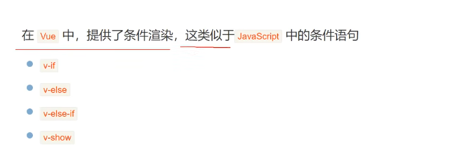

# 条件渲染



## 内容：（详见vue-条件渲染）
```html
<template>
    <h3>条件渲染</h3>
    <div v-if="flag">能看见这个吗？</div>
    <div v-else>能看见这个说明执行了else</div>


    <p style="color: red;">type=？</p>
    <div v-if="type === 'A'">A</div>
    <div v-if="type === 'B'">B</div>
    <div v-if="type === 'C'">C</div>
    <div v-if="type === 'D'">D</div>
    <div v-else>能看见这个说明执行了else,type不是ABCD</div>

    <div v-show="flag"></div>
    <!-- v-show在原理上比v-if要简单很多，v-show的元素一定会被渲染（设置了disable），而v-if一开始是false就不会渲染了 -->
    <!-- v-if的开销更大，可以观察上面的代码做对比 -->
</template>

<script>
    export default{
        data(){
            return{
                flag:false,
                // 当flag是flase的时候看不见<div v-if="flag">能看见这个吗？</div>
                type:'D'
            }
        }
    }
</script>


```


## 问题：
### 为什么有了v-if还要v-show呢？
原因：
